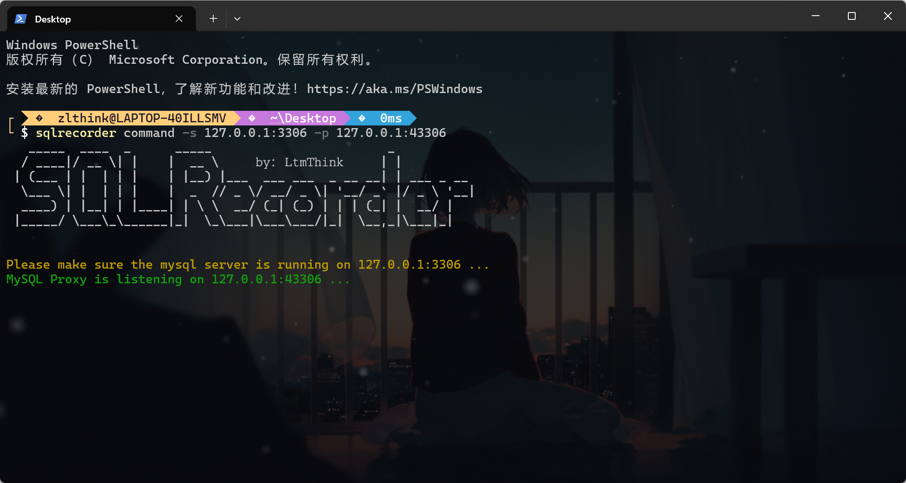
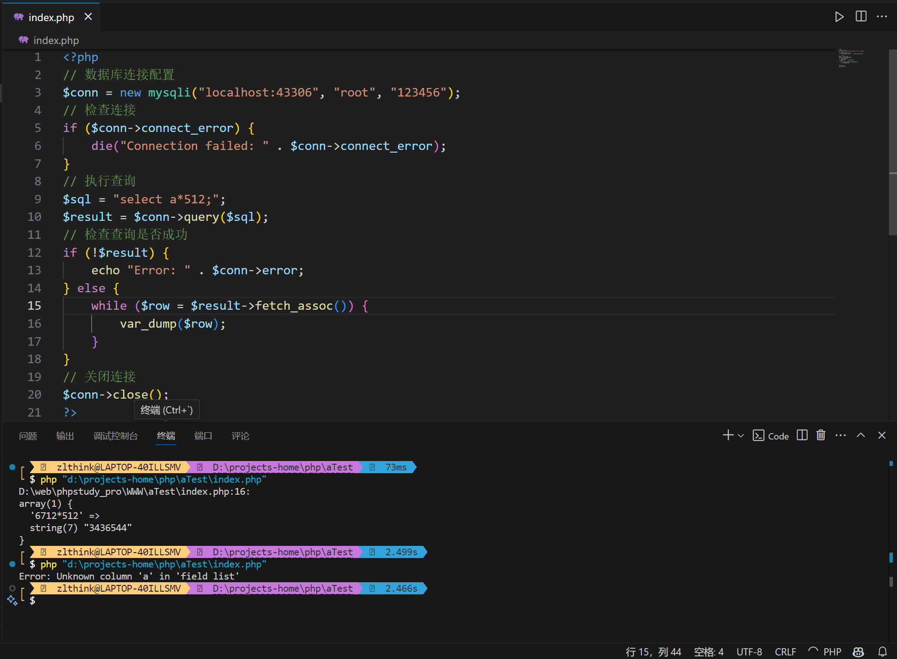
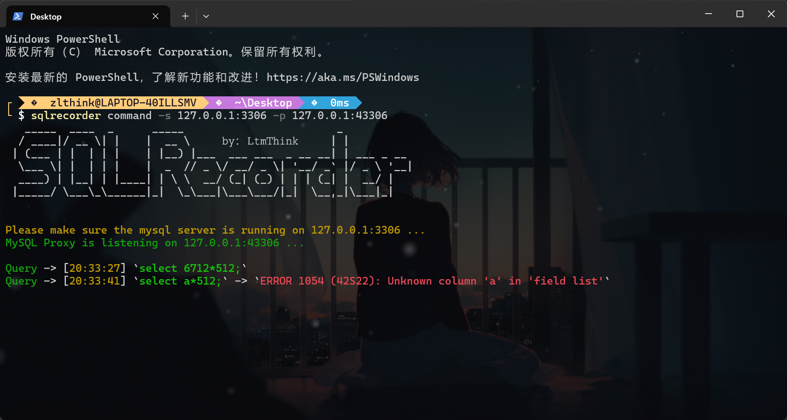
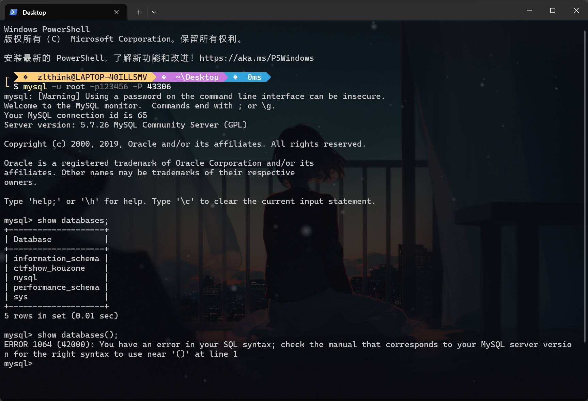
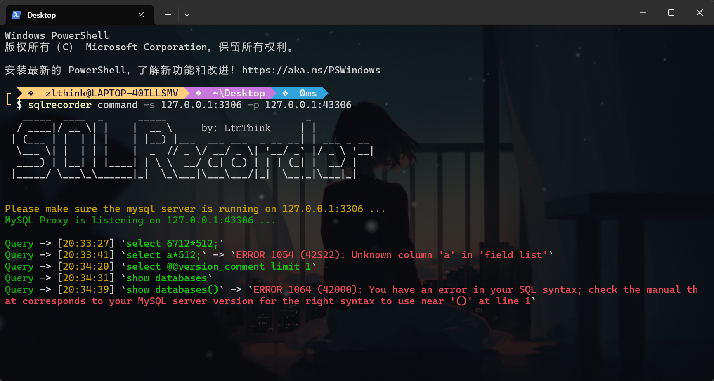

# SQLRecorder

## 简介

SQLRecorder能够实时记录应用运行时产生的SQL查询以及语法错误，方便代码审计时对SQL注入的实时关注。

SQLRecorder以代理的形式运行，区别于MySQL日志记录查询，SQLRecorder能够更好的感知SQL查询及其查询结果，并能记录日志所不能记录的MySQL语法错误。

SQLRecorder目前支持MySQL数据库查询记录。

## 使用

### 1.命令行窗口监控

#### 运行指令

命令：

```
sqlrecorder command -s 127.0.0.1:3306 -p 127.0.0.1:43306
```

该命令将使SQLRecorder作为代理端监听127.0.0.1:43306，并指定后续连接MySQL服务端地址为127.0.0.1:3306



#### 使用场景一

Web应用程序作为客户端连接SQLRecorder，SQLRecorder将实时记录产生的SQL查询以及语法错误





#### 使用场景二

使用mysql命令行工具(或其他连接工具)作为客户端连接SQLRecorder，SQLRecorder将实时记录产生的SQL查询以及语法错误



