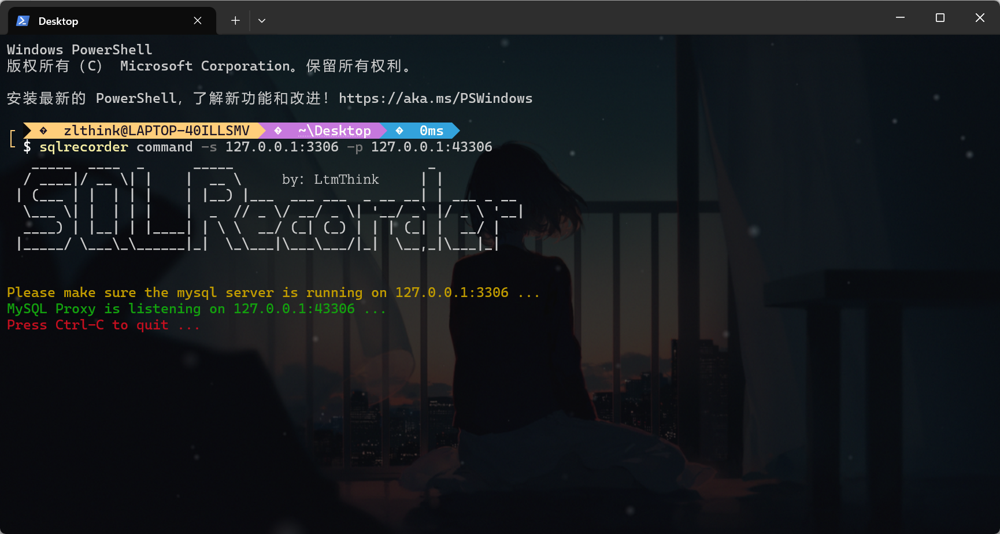
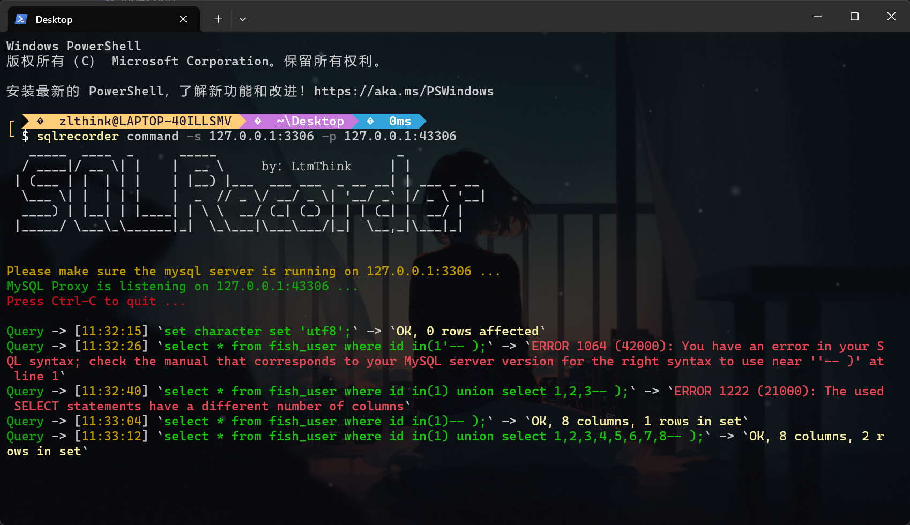
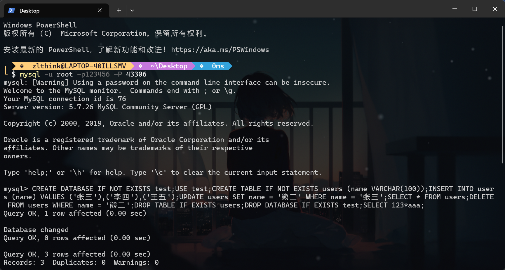
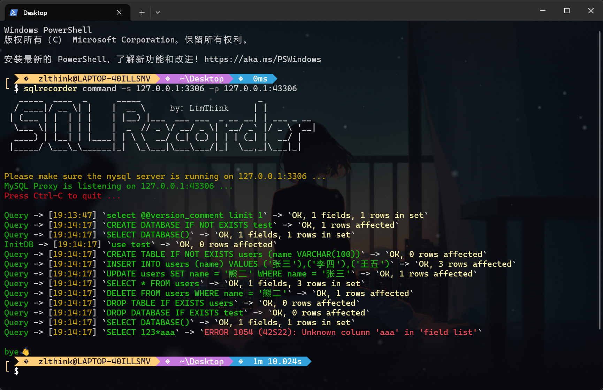
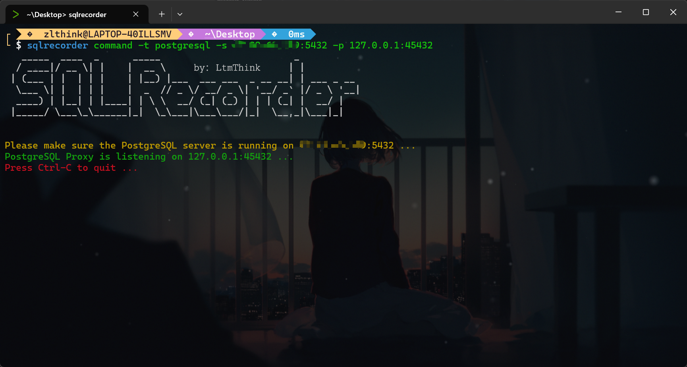
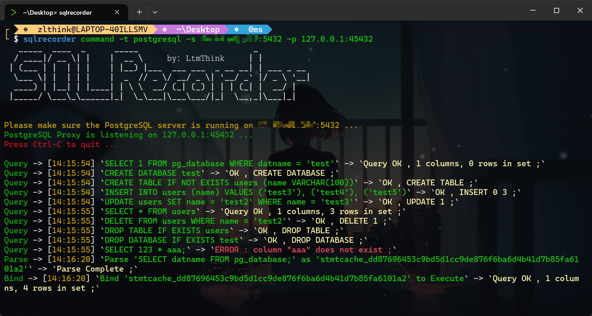

# SQLRecorder

## 简介

SQLRecorder能够实时记录应用运行时产生的SQL查询以及结果，方便代码审计时对SQL注入的实时关注。

SQLRecorder以代理的形式运行，区别于数据库日志记录，SQLRecorder能够更好的实时感知SQL查询，并能记录查询结果及查询错误。

SQLRecorder目前支持MySQL、PostgreSQL数据库查询记录，后续计划拓展对更多数据库的支持。

## 使用

### 1.MySQL监控

#### 运行指令

命令：

```
sqlrecorder command -s 127.0.0.1:3306 -p 127.0.0.1:43306
```

该命令将使SQLRecorder作为代理端监听127.0.0.1:43306，并指定后续连接MySQL服务端地址为127.0.0.1:3306



#### 使用场景一

Web应用程序作为客户端连接SQLRecorder，SQLRecorder将实时记录产生的SQL查询以及语法错误



#### 使用场景二

使用mysql命令行工具(或其他连接工具)作为客户端连接SQLRecorder，SQLRecorder将实时记录产生的SQL查询以及语法错误





### 2.PostgreSQL监控

#### 运行指令

```
sqlrecorder command -t postgresql -s 127.0.0.1:5432 -p 127.0.0.1:45432
```

该命令将使SQLRecorder作为代理端监听127.0.0.1:45432，并指定后续连接PostgreSQL服务端地址为127.0.0.1:5432



#### 实时监控



## 注意

1. 使用时关闭 SSL/TLS 连接
